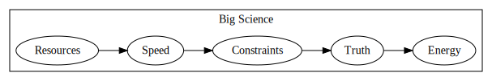
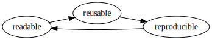

⓷ `collaboration.ipynb`

---
---
---
---
---
---
---
---
---
---
---
---
---
---
---
---
---
---
---
---

# The Modern Scientist

...will collaborate frequently because modern engineering problems are too challenging for individuals.  They will be required to share their more frequently with less preparation.

# Jupyter for sharing and collaboration

0. Jupyter is for sharing data
0. Jupyter is for collaboration
0. Jupyter is reusable

---
---
---
---
---
---
---
---
---
---
---
---
---
---
---
---
---
---
---
---

#  Jupyter is for sharing data
    
    digraph{rankdir="LR"; subgraph clusterd{label="Big Data"; Volume->Velocity->Variety->Veracity->Value}}

    digraph{rankdir="LR";subgraph clusters{label="Big Science"; Resources->Speed->Constraints->Truth->Energy}}

---
---
---
---
---
---
---
---
---
---
---
---
---
---
---
---
---
---
---
---

## Jupyter for Publishing

* [JOSS](https://joss.theoj.org)
* [Zenodo](http://about.zenodo.org/)
* [Figshare](https://figshare.com/)
* [data.world](https://data.world/)

---
---
---
---
---
---
---
---
---
---
---
---
---
---
---
---
---
---
---
---

    
## Jupyter for Teaching

# At Georgia Tech

* https://github.com/jacobeisenstein/gt-nlp-class
* https://github.com/rvuduc

    http://lorenabarba.com/tag/open-edx/

        <iframe
            width="800"
            height="600"
            src="http://lorenabarba.com/tag/open-edx/"
            frameborder="0"
            allowfullscreen
        ></iframe>
        

# [nbgrader](teaching.nbgrader['embed'])

    https://nbgrader.readthedocs.io/en/stable/user_guide/highlights.html

        <iframe
            width="800"
            height="600"
            src="https://nbgrader.readthedocs.io/en/stable/user_guide/highlights.html"
            frameborder="0"
            allowfullscreen
        ></iframe>
        

    http://data8.org/
    
# [The (B)erkley (I)nstitute for (D)ata (S)cience](teaching.bids['info'] "BIDS")

        <iframe
            width="800"
            height="600"
            src="http://data8.org/"
            frameborder="0"
            allowfullscreen
        ></iframe>
        

<blockquote class="twitter-tweet" data-lang="en">
5000+ total users, 600+ active at 8PM PST on <a href="https://twitter.com/BerkeleyDataSci?ref_src=twsrc%5Etfw">@BerkeleyDataSci</a> JupyterHub :) I wonder if this is the largest single JupyterHub running? <a href="https://twitter.com/ProjectJupyter?ref_src=twsrc%5Etfw">@ProjectJupyter</a> <a href="https://t.co/haH3aFPJ87">pic.twitter.com/haH3aFPJ87</a>
&mdash; Yuvi Panda (@yuvipanda) <a href="https://twitter.com/yuvipanda/status/956381252428288000?ref_src=twsrc%5Etfw">January 25, 2018</a></blockquote>

---
---
---
---
---
---
---
---
---
---
---
---
---
---
---
---
---
---
---
---

## Jupyter for profit

* [General Assembly](https://generalassemb.ly/)
    * https://github.com/justmarkham/DAT8
    * https://github.com/generalassembly-studio/data-science-101-cwe-materials
* [Code Academy](https://www.codecademy.com/)
* [Data Camp](https://www.datacamp.com/)
    * [Podcast](https://www.datacamp.com/community/podcast)

---
---
---
---
---
---
---
---
---
---
---
---
---
---
---
---
---
---
---
---

## Jupyter for Books

# [Sebastian Raschka](https://github.com/rasbt)

# [Python Machine Learning (2nd edition)](https://github.com/rasbt/python-machine-learning-book-2nd-edition)

# [Introduction to Artificial Neural Networks and Deep Learning: A Practical Guide with Applications in Python](https://github.com/rasbt/deep-learning-book)

# [Jake VanderPlas](https://github.com/jakevdp)

## [Python Data Science Handbook](https://github.com/jakevdp/PythonDataScienceHandbook)

> - [Jake VanderPlas](http://jakevdp.github.io/)

# Immersive on demand notebooks with [O'Reilly Oriole](https://www.safaribooksonline.com/oriole/)

---
---
---
---
---
---
---
---
---
---
---
---
---
---
---
---
---
---
---
---

#  Jupyter is for collaboration

    https://mybinder.org

        <iframe
            width="800"
            height="600"
            src="https://mybinder.org"
            frameborder="0"
            allowfullscreen
        ></iframe>
        

    http://jupyterhub.readthedocs.io/en/latest/

        <iframe
            width="800"
            height="600"
            src="http://jupyterhub.readthedocs.io/en/latest/"
            frameborder="0"
            allowfullscreen
        ></iframe>
        

    http://zero-to-jupyterhub.readthedocs.io/

        <iframe
            width="800"
            height="600"
            src="http://zero-to-jupyterhub.readthedocs.io/"
            frameborder="0"
            allowfullscreen
        ></iframe>
        

    https://www.chanzuckerberg.com/wp-content/uploads/2017/03/RFA-Computational-Tools.pdf

        <iframe
            width="800"
            height="600"
            src="https://www.chanzuckerberg.com/wp-content/uploads/2017/03/RFA-Computational-Tools.pdf"
            frameborder="0"
            allowfullscreen
        ></iframe>
        

---
---
---
---
---
---
---
---
---
---
---
---
---
---
---
---
---
---
---
---

#  Jupyter is reusable

    digraph {rankdir="LR"; readable -> reusable -> reproducible -> readable}
    
Jupyter provides valuable components for the many facets of literate computing.  Modern scientists must focus on narrative over tools.  Below are some style guides to consider while consuming, creating, and sharing literate documents.

---
---
---
---
---
---
---
---
---
---
---
---
---
---
---
---
---
---
---
---

    with __import__('IPython').utils.capture.capture_output() as out:
       
    
        reload(__import__('this'))
        
        
    out.show()
---

    The Zen of Python, by Tim Peters
    
    Beautiful is better than ugly.
    Explicit is better than implicit.
    Simple is better than complex.
    Complex is better than complicated.
    Flat is better than nested.
    Sparse is better than dense.
    Readability counts.
    Special cases aren't special enough to break the rules.
    Although practicality beats purity.
    Errors should never pass silently.
    Unless explicitly silenced.
    In the face of ambiguity, refuse the temptation to guess.
    There should be one-- and preferably only one --obvious way to do it.
    Although that way may not be obvious at first unless you're Dutch.
    Now is better than never.
    Although never is often better than *right* now.
    If the implementation is hard to explain, it's a bad idea.
    If the implementation is easy to explain, it may be a good idea.
    Namespaces are one honking great idea -- let's do more of those!
    The Zen of Python, by Tim Peters
    
    Beautiful is better than ugly.
    Explicit is better than implicit.
    Simple is better than complex.
    Complex is better than complicated.
    Flat is better than nested.
    Sparse is better than dense.
    Readability counts.
    Special cases aren't special enough to break the rules.
    Although practicality beats purity.
    Errors should never pass silently.
    Unless explicitly silenced.
    In the face of ambiguity, refuse the temptation to guess.
    There should be one-- and preferably only one --obvious way to do it.
    Although that way may not be obvious at first unless you're Dutch.
    Now is better than never.
    Although never is often better than *right* now.
    If the implementation is hard to explain, it's a bad idea.
    If the implementation is easy to explain, it may be a good idea.
    Namespaces are one honking great idea -- let's do more of those!

# [Best of the Best Python Practices](https://gist.github.com/sloria/7001839)
# [Mailchimp Styleguide](http://styleguide.mailchimp.com/)
# [Because “imagine everyone's naked” is terrible advice](https://speaking.io/)
# [Can you describe your research in a README](https://github.com/noffle/art-of-readme)?

    http://nbviewer.jupyter.org/github/jupyterday-atlanta-2016/oriole_jupyterday_atl/blob/master/oriole_talk.ipynb

        <iframe
            width="800"
            height="600"
            src="http://nbviewer.jupyter.org/github/jupyterday-atlanta-2016/oriole_jupyterday_atl/blob/master/oriole_talk.ipynb"
            frameborder="0"
            allowfullscreen
        ></iframe>
        

---
---
---
---
---
---
---
---
---
---
---
---
---
---
---
---
---
---
---
---

---

> 🔌 The notebooks for `ten` use an experimental library [`rites`](https://github.com/deathbeds/rites/tree/master/rites); which provides markdown, templating, and macros to notebook cells.

    import ten

# Modern scientists must learn to draw real data with computers.
> ... stating the problem definition without drawing something is mere lip-service.
> - Prof. George Polya - How to Solve It

* Jupyter is scientific software    
* Jupyter is language agnostic
* Jupyter is an ecosystem
* Jupyter is a community
* Jupyter is data 
* Jupyter is literate computing
* Jupyter is for documents
* Jupyter is for sharing data
* Jupyter is for collaboration
* Jupyter is reusable

# Thank you ✌️

# For more Jupyter

## [Jupyter Day Atlanta](jupyter-day-atlanta.eventbrite.com)
## [Atlanta Jupyter User Group](https://www.meetup.com/Atlanta-Jupyter-User-Group/)
## [JupyterCon](https://conferences.oreilly.com/jupyter/jup-ny)

