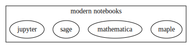
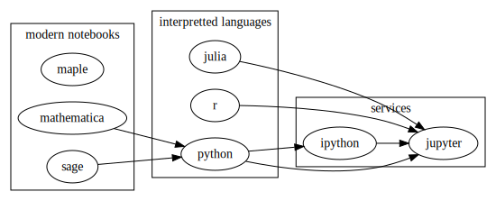

⓵ [History and Community](history.ipynb)

---
---
---
---
---
---
---
---
---
---
---
---
---
---
---
---
---
---
---
---

# The Modern Scientist ...

... interacts with scientific discovery on computers, they seek measurements _in silico_, not on paper.  They rely on community vetted resources as tools for discovery, and their science is not computer science.  They will write code for people and machines.

---
---
---
---
---
---
---
---
---
---
---
---
---
---
---
---
---
---
---
---

#  Jupyter is scientific software    

    people.fperez
    

> Fernando Perez | [Github](https://github.com/fperez) | [Twitter](https://twitter.com/fperez) | 

### [Fernando Perez](None) - [The IPython notebook: a historical retrospective 👍](http://blog.fperez.org/2012/01/ipython-notebook-historical.html)    

> ... As any self-respecting graduate student with a dissertation deadline looming would do, I threw myself full-time into building the first 'real' IPython by merging my code with both of theirs (eventually I did graduate, by the way).
    

    digraph {rankdir="UD"; 
             subgraph clusternb{label="modern notebooks";maple mathematica  sage jupyter}; }

---
---
---
---
---
---
---
---
---
---
---
---
---
---
---
---
---
---
---
---

# Oh 🍁

### [Application of microstructure sensitive design to structural components produced from hexagonal polycrystalline metals](https://www.sciencedirect.com/science/article/pii/S0927025607003369 "2007")

---
---
---
---
---
---
---
---
---
---
---
---
---
---
---
---
---
---
---
---

# Open Source Science has made computation accessible to everyone.

---
---
---
---
---
---
---
---
---
---
---
---
---
---
---
---
---
---
---
---

> ...By that point [Brian Granger]() and [Min Ragan-Kelley]() had come on board and we had built the Twisted-based parallel tools. Using this, Min got a notebook prototype working using an SQL/SQLAlchemy backend.  We had the opportunity to work on many of these ideas during a workshop on Interactive Parallel Computation that William and I co-organized (along with others).  Like Sage, this prototype used a browser for the client but it tried to retain the 'IPython experience', something the Sage notebook didn't provide.

    digraph {rankdir="LR"; 
             subgraph clusterservices{label="services";ipython ->jupyter }; subgraph clusterlang{label="interpretted languages";julia r python}; subgraph clusternb{label="modern notebooks";maple mathematica  -> python; sage ->python}; julia->jupyter; r-> jupyter; python -> ipython}

## Jupyter is ...

* Interactive
* Parallelizable

<code><pre>  * Literate</pre></code>

---
---
---
---
---
---
---
---
---
---
---
---
---
---
---
---
---
---
---
---

#  Jupyter is language agnostic

    graph {rankdir="LR"; data--science--computing--data}

#### ["Literate computing" and computational reproducibility: IPython in the age of data-driven journalism](http://blog.fperez.org/2013/04/literate-computing-and-computational.html)
> Our job with Jupyter~~IPython~~ is to think deeply about questions regarding the intersection of _**computing, data and science**_, but it's clear to me at this point that we can contribute in contexts beyond pure scientific research. I hope we'll be able to provide folks who have a _**direct intersection with the public**_, such as journalists, with tools that help a more informed and productive debate.

> - Fernando Perez

---
---
---
---
---
---
---
---
---
---
---
---
---
---
---
---
---
---
---
---

## [Python is a glue language](https://docs.scipy.org/doc/numpy/user/c-info.python-as-glue.html)

#### C

    import cython
    import ctypes

#### Fortran
    
    from numpy import f2py
    
#### Java
    
    import pyspark
    
#### Async programming

    import dask  
    import tornado
    
#### Functional Programming

    import toolz
    import poser
    
    
#### Visualization
    
    import altair
    import bokeh
    import seaborn
    import matplotlib
    import holoviews
    
#### Machine Learning

    import sklearn
    import tpot

# APIs as creole [`sklearn`](http://scikit-learn.org/stable/)

    from sklearn                                   .base import TransformerMixin, ClassifierMixin, RegressorMixin
    print(a.map(a.attrgetter('__doc__'))["\n".join]((TransformerMixin, ClassifierMixin, RegressorMixin)))
    

    Mixin class for all transformers in scikit-learn.
    Mixin class for all classifiers in scikit-learn.
    Mixin class for all regression estimators in scikit-learn.

    print(TransformerMixin.fit_transform.__doc__)

    Fit to data, then transform it.
    
            Fits transformer to X and y with optional parameters fit_params
            and returns a transformed version of X.
    
            Parameters
            ----------
            X : numpy array of shape [n_samples, n_features]
                Training set.
    
            y : numpy array of shape [n_samples]
                Target values.
    
            Returns
            -------
            X_new : numpy array of shape [n_samples, n_features_new]
                Transformed array.
    
            

    http://githut.info/

        <iframe
            width="800"
            height="600"
            src="http://githut.info/"
            frameborder="0"
            allowfullscreen
        ></iframe>
        

    https://stackoverflow.blog/2017/09/06/incredible-growth-python/

        <iframe
            width="800"
            height="600"
            src="https://stackoverflow.blog/2017/09/06/incredible-growth-python/"
            frameborder="0"
            allowfullscreen
        ></iframe>
        

# How flexible is python?

    def pairwise_python(X):
        M = X.shape[0]
        N = X.shape[1]
        D = np.empty((M, M))
        for i in range(M):
            for j in range(M):
                d = 0.0
                for k in range(N):
                    tmp = X[i, k] - X[j, k]
                    d += tmp * tmp
                D[i, j] = np.sqrt(d)
        return D

---

### Compile Javascript

    from flexx.pyscript import py2js
    if __name__ == '__main__':        
        
        
        js = py2js(pairwise_python)
    

### Compile Assembly Code

[Just in time compilation]() with [numba]().

    from numba import jit
    bytecode = jit(pairwise_python)
    
---

> [A comparison of fortran, ctypes, cython, and numba by Jake VanderPlas.](http://jakevdp.github.io/blog/2013/06/15/numba-vs-cython-take-2/)

---

## If Python isn't enough there are 103 Jupyter __kernel__ registered specifications.
    
    counted = a.pandas.read_html().first()(jupyter.count).T

<table border="1" class="dataframe">
  <thead>
    <tr style="text-align: right;">
      <th></th>
      <th>Name</th>
      <th>Jupyter/IPython Version</th>
      <th>Language(s) Version</th>
      <th>3rd party dependencies</th>
      <th>Example Notebooks</th>
      <th>Notes</th>
    </tr>
  </thead>
  <tbody>
    <tr>
      <th>0</th>
      <td>Coarray-Fortran</td>
      <td>Jupyter 4.0</td>
      <td>Fortran 2008/2015</td>
      <td>GFortran &gt;= 7.1, OpenCoarrays, MPICH &gt;= 3.2</td>
      <td>Demo, Binder demo</td>
      <td>Docker image</td>
    </tr>
    <tr>
      <th>1</th>
      <td>sparkmagic</td>
      <td>Jupyter &gt;=4.0</td>
      <td>Pyspark (Python 2 &amp; 3), Spark (Scala), SparkR (R)</td>
      <td>Livy</td>
      <td>Notebooks, Docker Images</td>
      <td>This kernels are implemented via the magics ma...</td>
    </tr>
    <tr>
      <th>2</th>
      <td>sas_kernel</td>
      <td>Jupyter 4.0</td>
      <td>python &gt;= 3.3</td>
      <td>SAS 9.4 or higher</td>
      <td>NaN</td>
      <td>NaN</td>
    </tr>
    <tr>
      <th>3</th>
      <td>IPyKernel</td>
      <td>Jupyter 4.0</td>
      <td>python 2.7, &gt;= 3.3</td>
      <td>pyzmq</td>
      <td>NaN</td>
      <td>NaN</td>
    </tr>
    <tr>
      <th>4</th>
      <td>IJulia</td>
      <td>NaN</td>
      <td>julia &gt;= 0.3</td>
      <td>NaN</td>
      <td>NaN</td>
      <td>NaN</td>
    </tr>
    <tr>
      <th>5</th>
      <td>IHaskell</td>
      <td>NaN</td>
      <td>ghc &gt;= 7.6</td>
      <td>NaN</td>
      <td>NaN</td>
      <td>NaN</td>
    </tr>
    <tr>
      <th>6</th>
      <td>IRuby</td>
      <td>NaN</td>
      <td>ruby &gt;= 2.1</td>
      <td>NaN</td>
      <td>NaN</td>
      <td>NaN</td>
    </tr>
    <tr>
      <th>7</th>
      <td>IJavascript</td>
      <td>NaN</td>
      <td>nodejs &gt;= 0.10</td>
      <td>NaN</td>
      <td>NaN</td>
      <td>NaN</td>
    </tr>
    <tr>
      <th>8</th>
      <td>jpCoffeescript</td>
      <td>NaN</td>
      <td>coffeescript &gt;= 1.7</td>
      <td>NaN</td>
      <td>NaN</td>
      <td>NaN</td>
    </tr>
    <tr>
      <th>9</th>
      <td>ICSharp</td>
      <td>Jupyter 4.0</td>
      <td>C# 4.0+</td>
      <td>scriptcs</td>
      <td>NaN</td>
      <td>NaN</td>
    </tr>
    <tr>
      <th>10</th>
      <td>IRKernel</td>
      <td>IPython 3.0</td>
      <td>R 3.2</td>
      <td>rzmq</td>
      <td>NaN</td>
      <td>NaN</td>
    </tr>
    <tr>
      <th>11</th>
      <td>SageMath</td>
      <td>Jupyter 4</td>
      <td>Any</td>
      <td>many</td>
      <td>NaN</td>
      <td>NaN</td>
    </tr>
    <tr>
      <th>12</th>
      <td>pari_jupyter</td>
      <td>Jupyter 4</td>
      <td>PARI/GP &gt;= 2.9</td>
      <td>NaN</td>
      <td>NaN</td>
      <td>NaN</td>
    </tr>
    <tr>
      <th>13</th>
      <td>IFSharp</td>
      <td>IPython 2.0</td>
      <td>F#</td>
      <td>NaN</td>
      <td>Features</td>
      <td>NaN</td>
    </tr>
    <tr>
      <th>14</th>
      <td>lgo</td>
      <td>Jupyter &gt;= 4, JupyterLab</td>
      <td>Go &gt;= 1.8</td>
      <td>ZeroMQ (4.x)</td>
      <td>Example</td>
      <td>Docker image</td>
    </tr>
    <tr>
      <th>15</th>
      <td>gopherlab</td>
      <td>Jupyter 4.1, JupyterLab</td>
      <td>Go &gt;= 1.6</td>
      <td>ZeroMQ (4.x)</td>
      <td>examples</td>
      <td>Deprecated, use gophernotes</td>
    </tr>
    <tr>
      <th>16</th>
      <td>Gophernotes</td>
      <td>Jupyter 4, JupyterLab, nteract</td>
      <td>Go &gt;= 1.9</td>
      <td>ZeroMQ 4.x.x</td>
      <td>examples</td>
      <td>docker image</td>
    </tr>
    <tr>
      <th>17</th>
      <td>IGo</td>
      <td>NaN</td>
      <td>Go &gt;= 1.4</td>
      <td>NaN</td>
      <td>NaN</td>
      <td>NaN</td>
    </tr>
    <tr>
      <th>18</th>
      <td>IScala</td>
      <td>NaN</td>
      <td>Scala</td>
      <td>NaN</td>
      <td>NaN</td>
      <td>NaN</td>
    </tr>
    <tr>
      <th>19</th>
      <td>Jupyter-scala</td>
      <td>IPython&gt;=3.0</td>
      <td>Scala&gt;=2.10</td>
      <td>NaN</td>
      <td>example</td>
      <td>NaN</td>
    </tr>
    <tr>
      <th>20</th>
      <td>IErlang</td>
      <td>IPython 2.3</td>
      <td>Erlang</td>
      <td>rebar</td>
      <td>NaN</td>
      <td>NaN</td>
    </tr>
    <tr>
      <th>21</th>
      <td>ITorch</td>
      <td>IPython &gt;= 2.2 and &lt;= 5.x</td>
      <td>Torch 7 (LuaJIT)</td>
      <td>NaN</td>
      <td>NaN</td>
      <td>NaN</td>
    </tr>
    <tr>
      <th>22</th>
      <td>IElixir</td>
      <td>Jupyter &lt; 6.0</td>
      <td>Elixir &lt; 1.5</td>
      <td>Erlang OTP &lt;= 19.3, Rebar</td>
      <td>example</td>
      <td>IElixir Notebook in Docker</td>
    </tr>
    <tr>
      <th>23</th>
      <td>ierl</td>
      <td>Jupyter &gt;= 4.0</td>
      <td>Erlang 19 or 20, Elixir 1.4 or 1.5, LFE 1.2</td>
      <td>Erlang, (optional) Elixir</td>
      <td>NaN</td>
      <td>NaN</td>
    </tr>
    <tr>
      <th>24</th>
      <td>IAldor</td>
      <td>IPython &gt;= 1</td>
      <td>Aldor</td>
      <td>NaN</td>
      <td>NaN</td>
      <td>NaN</td>
    </tr>
    <tr>
      <th>25</th>
      <td>IOCaml</td>
      <td>IPython &gt;= 1.1</td>
      <td>OCaml &gt;= 4.01</td>
      <td>opam</td>
      <td>NaN</td>
      <td>NaN</td>
    </tr>
    <tr>
      <th>26</th>
      <td>OCaml-Jupyter</td>
      <td>Jupyter &gt;= 4.0</td>
      <td>OCaml &gt;= 4.02</td>
      <td>opam</td>
      <td>Example</td>
      <td>Docker image</td>
    </tr>
    <tr>
      <th>27</th>
      <td>IForth</td>
      <td>IPython &gt;= 3</td>
      <td>Forth</td>
      <td>NaN</td>
      <td>NaN</td>
      <td>NaN</td>
    </tr>
    <tr>
      <th>28</th>
      <td>peforth</td>
      <td>IPython 6/Jupyter 5</td>
      <td>Forth</td>
      <td>NaN</td>
      <td>Example</td>
      <td>python debugger in FORTH syntax</td>
    </tr>
    <tr>
      <th>29</th>
      <td>IPerl</td>
      <td>NaN</td>
      <td>Perl 5</td>
      <td>NaN</td>
      <td>NaN</td>
      <td>NaN</td>
    </tr>
    <tr>
      <th>30</th>
      <td>Perl6</td>
      <td>Jupyter &gt;= 4</td>
      <td>Perl 6.c</td>
      <td>zeromq 4</td>
      <td>NaN</td>
      <td>NaN</td>
    </tr>
    <tr>
      <th>31</th>
      <td>IPerl6</td>
      <td>NaN</td>
      <td>Perl 6</td>
      <td>NaN</td>
      <td>NaN</td>
      <td>NaN</td>
    </tr>
    <tr>
      <th>32</th>
      <td>Jupyter-Perl6</td>
      <td>Jupyter</td>
      <td>Perl 6.C</td>
      <td>Rakudo Perl 6</td>
      <td>NaN</td>
      <td>NaN</td>
    </tr>
    <tr>
      <th>33</th>
      <td>IPHP</td>
      <td>IPython &gt;= 2</td>
      <td>PHP &gt;= 5.4</td>
      <td>composer</td>
      <td>NaN</td>
      <td>DEPRECATED, use Jupyter-PHP</td>
    </tr>
    <tr>
      <th>34</th>
      <td>Jupyter-PHP</td>
      <td>Jupyter 4.0</td>
      <td>PHP &gt;= 7.0.0</td>
      <td>composer, php-zmq</td>
      <td>NaN</td>
      <td>NaN</td>
    </tr>
    <tr>
      <th>35</th>
      <td>IOctave</td>
      <td>Jupyter</td>
      <td>Octave</td>
      <td>NaN</td>
      <td>Example</td>
      <td>MetaKernel</td>
    </tr>
    <tr>
      <th>36</th>
      <td>IScilab</td>
      <td>Jupyter</td>
      <td>Scilab</td>
      <td>NaN</td>
      <td>Example</td>
      <td>MetaKernel</td>
    </tr>
    <tr>
      <th>37</th>
      <td>MATLAB Kernel</td>
      <td>Jupyter</td>
      <td>Matlab</td>
      <td>pymatbridge</td>
      <td>Example</td>
      <td>MetaKernel</td>
    </tr>
    <tr>
      <th>38</th>
      <td>Bash</td>
      <td>IPython &gt;= 3</td>
      <td>bash</td>
      <td>NaN</td>
      <td>NaN</td>
      <td>Wrapper</td>
    </tr>
    <tr>
      <th>39</th>
      <td>PowerShell</td>
      <td>IPython &gt;= 3</td>
      <td>Windows</td>
      <td>NaN</td>
      <td>NaN</td>
      <td>Wrapper, Based on Bash Kernel</td>
    </tr>
    <tr>
      <th>40</th>
      <td>CloJupyter</td>
      <td>Jupyter</td>
      <td>Clojure &gt;= 1.7</td>
      <td>NaN</td>
      <td>NaN</td>
      <td>NaN</td>
    </tr>
    <tr>
      <th>41</th>
      <td>CLJ-Jupyter</td>
      <td>Jupyter</td>
      <td>Clojure</td>
      <td>NaN</td>
      <td>NaN</td>
      <td>Abandoned as of 2017-02-12</td>
    </tr>
    <tr>
      <th>42</th>
      <td>jupyter-kernel-jsr223</td>
      <td>Jupyter&gt;=4.0</td>
      <td>Clojure 1.8</td>
      <td>clojure-jrs223, Java&gt;=7</td>
      <td>NaN</td>
      <td>Java based JSR223 compliant</td>
    </tr>
    <tr>
      <th>43</th>
      <td>Hy Kernel</td>
      <td>Jupyter</td>
      <td>Hy</td>
      <td>NaN</td>
      <td>Tutorial</td>
      <td>treats Hy as Python pre-processor</td>
    </tr>
    <tr>
      <th>44</th>
      <td>Calysto Hy</td>
      <td>Jupyter</td>
      <td>Hy</td>
      <td>NaN</td>
      <td>Tutorial</td>
      <td>based on MetaKernel (magics, shell, parallel, ...</td>
    </tr>
    <tr>
      <th>45</th>
      <td>Redis Kernel</td>
      <td>IPython &gt;= 3</td>
      <td>redis</td>
      <td>NaN</td>
      <td>NaN</td>
      <td>Wrapper</td>
    </tr>
    <tr>
      <th>46</th>
      <td>jove</td>
      <td>NaN</td>
      <td>io.js</td>
      <td>NaN</td>
      <td>NaN</td>
      <td>NaN</td>
    </tr>
    <tr>
      <th>47</th>
      <td>jp-babel</td>
      <td>Jupyter</td>
      <td>Babel</td>
      <td>NaN</td>
      <td>NaN</td>
      <td>NaN</td>
    </tr>
    <tr>
      <th>48</th>
      <td>ICalico</td>
      <td>IPython &gt;= 2</td>
      <td>multiple</td>
      <td>NaN</td>
      <td>Index</td>
      <td>NaN</td>
    </tr>
    <tr>
      <th>49</th>
      <td>IMathics</td>
      <td>NaN</td>
      <td>Mathics</td>
      <td>NaN</td>
      <td>NaN</td>
      <td>NaN</td>
    </tr>
    <tr>
      <th>50</th>
      <td>IWolfram</td>
      <td>NaN</td>
      <td>Wolfram Mathematica</td>
      <td>Wolfram Mathematica(R), Metakernel</td>
      <td>NaN</td>
      <td>MetaKernel</td>
    </tr>
    <tr>
      <th>51</th>
      <td>Lua Kernel</td>
      <td>NaN</td>
      <td>Lua</td>
      <td>NaN</td>
      <td>NaN</td>
      <td>NaN</td>
    </tr>
    <tr>
      <th>52</th>
      <td>IPurescript</td>
      <td>NaN</td>
      <td>Purescript</td>
      <td>NaN</td>
      <td>NaN</td>
      <td>NaN</td>
    </tr>
    <tr>
      <th>53</th>
      <td>IPyLua</td>
      <td>NaN</td>
      <td>Lua</td>
      <td>NaN</td>
      <td>NaN</td>
      <td>Fork of Lua Kernel</td>
    </tr>
    <tr>
      <th>54</th>
      <td>Calysto Scheme</td>
      <td>NaN</td>
      <td>Scheme</td>
      <td>NaN</td>
      <td>Reference Guide</td>
      <td>MetaKernel</td>
    </tr>
    <tr>
      <th>55</th>
      <td>Calysto Processing</td>
      <td>NaN</td>
      <td>Processing.js &gt;= 2</td>
      <td>NaN</td>
      <td>NaN</td>
      <td>MetaKernel</td>
    </tr>
    <tr>
      <th>56</th>
      <td>idl_kernel</td>
      <td>NaN</td>
      <td>IDL</td>
      <td>NaN</td>
      <td>NaN</td>
      <td>IDL seem to have a built-in kernel starting wi...</td>
    </tr>
    <tr>
      <th>57</th>
      <td>Mochi Kernel</td>
      <td>NaN</td>
      <td>Mochi</td>
      <td>NaN</td>
      <td>NaN</td>
      <td>NaN</td>
    </tr>
    <tr>
      <th>58</th>
      <td>Lua (used in Splash)</td>
      <td>NaN</td>
      <td>Lua</td>
      <td>NaN</td>
      <td>NaN</td>
      <td>NaN</td>
    </tr>
    <tr>
      <th>59</th>
      <td>Apache Toree (formerly Spark Kernel)</td>
      <td>Jupyter</td>
      <td>Scala, Python, R</td>
      <td>Spark &gt;= 1.5</td>
      <td>Example</td>
      <td>NaN</td>
    </tr>
    <tr>
      <th>60</th>
      <td>Skulpt Python Kernel</td>
      <td>NaN</td>
      <td>Skulpt Python</td>
      <td>NaN</td>
      <td>Examples</td>
      <td>MetaKernel</td>
    </tr>
    <tr>
      <th>61</th>
      <td>MetaKernel Bash</td>
      <td>NaN</td>
      <td>bash</td>
      <td>NaN</td>
      <td>NaN</td>
      <td>MetaKernel</td>
    </tr>
    <tr>
      <th>62</th>
      <td>MetaKernel Python</td>
      <td>NaN</td>
      <td>python</td>
      <td>NaN</td>
      <td>NaN</td>
      <td>MetaKernel</td>
    </tr>
    <tr>
      <th>63</th>
      <td>IVisual</td>
      <td>NaN</td>
      <td>VPython</td>
      <td>NaN</td>
      <td>Ball-in-Box</td>
      <td>NaN</td>
    </tr>
    <tr>
      <th>64</th>
      <td>IBrainfuck</td>
      <td>NaN</td>
      <td>Brainfuck</td>
      <td>NaN</td>
      <td>Demo</td>
      <td>Wrapper</td>
    </tr>
    <tr>
      <th>65</th>
      <td>KDB+/Q Kernel (IKdbQ)</td>
      <td>IPython &gt;= 3.1</td>
      <td>Q</td>
      <td>qzmq, qcrypt</td>
      <td>NaN</td>
      <td>NaN</td>
    </tr>
    <tr>
      <th>66</th>
      <td>KDB+/Q Kernel (KdbQ Kernel)</td>
      <td>Jupyter</td>
      <td>Q</td>
      <td>NaN</td>
      <td>NaN</td>
      <td>NaN</td>
    </tr>
    <tr>
      <th>67</th>
      <td>ICryptol</td>
      <td>NaN</td>
      <td>Cryptol</td>
      <td>CVC4</td>
      <td>NaN</td>
      <td>NaN</td>
    </tr>
    <tr>
      <th>68</th>
      <td>cling</td>
      <td>Jupyter 4</td>
      <td>C++</td>
      <td>NaN</td>
      <td>Example</td>
      <td>NaN</td>
    </tr>
    <tr>
      <th>69</th>
      <td>Xonsh</td>
      <td>NaN</td>
      <td>Xonsh</td>
      <td>NaN</td>
      <td>Example</td>
      <td>MetaKernel</td>
    </tr>
    <tr>
      <th>70</th>
      <td>Prolog</td>
      <td>NaN</td>
      <td>Prolog</td>
      <td>NaN</td>
      <td>NaN</td>
      <td>MetaKernel</td>
    </tr>
    <tr>
      <th>71</th>
      <td>cl-jupyter</td>
      <td>Jupyter</td>
      <td>Common Lisp</td>
      <td>Quicklisp</td>
      <td>About</td>
      <td>NaN</td>
    </tr>
    <tr>
      <th>72</th>
      <td>Maxima-Jupyter</td>
      <td>Jupyter</td>
      <td>Maxima</td>
      <td>Quicklisp</td>
      <td>NaN</td>
      <td>NaN</td>
    </tr>
    <tr>
      <th>73</th>
      <td>Calysto LC3</td>
      <td>NaN</td>
      <td>NaN</td>
      <td>NaN</td>
      <td>NaN</td>
      <td>Assembly Language for the Little Computer 3</td>
    </tr>
    <tr>
      <th>74</th>
      <td>Yacas</td>
      <td>NaN</td>
      <td>YACAS</td>
      <td>NaN</td>
      <td>NaN</td>
      <td>NaN</td>
    </tr>
    <tr>
      <th>75</th>
      <td>IJython</td>
      <td>NaN</td>
      <td>Jython 2.7</td>
      <td>NaN</td>
      <td>NaN</td>
      <td>NaN</td>
    </tr>
    <tr>
      <th>76</th>
      <td>ROOT</td>
      <td>Jupyter</td>
      <td>C++/python</td>
      <td>ROOT &gt;= 6.05</td>
      <td>NaN</td>
      <td>NaN</td>
    </tr>
    <tr>
      <th>77</th>
      <td>Gnuplot Kernel</td>
      <td>NaN</td>
      <td>Gnuplot</td>
      <td>NaN</td>
      <td>Example</td>
      <td>MetaKernel</td>
    </tr>
    <tr>
      <th>78</th>
      <td>Tcl</td>
      <td>Jupyter</td>
      <td>Tcl 8.5</td>
      <td>NaN</td>
      <td>NaN</td>
      <td>Based on Bash Kernel</td>
    </tr>
    <tr>
      <th>79</th>
      <td>J</td>
      <td>Jupyter</td>
      <td>J 805</td>
      <td>NaN</td>
      <td>Examples</td>
      <td>NaN</td>
    </tr>
    <tr>
      <th>80</th>
      <td>Jython</td>
      <td>Jupyter&gt;=4.0</td>
      <td>Jython&gt;=2.7.0</td>
      <td>Java&gt;=7</td>
      <td>NaN</td>
      <td>Java based JSR223 compliant</td>
    </tr>
    <tr>
      <th>81</th>
      <td>C</td>
      <td>Jupyter</td>
      <td>C</td>
      <td>gcc</td>
      <td>NaN</td>
      <td>NaN</td>
    </tr>
    <tr>
      <th>82</th>
      <td>TaQL</td>
      <td>Jupyter</td>
      <td>TaQL</td>
      <td>python-casacore</td>
      <td>TaQL tutorial</td>
      <td>NaN</td>
    </tr>
    <tr>
      <th>83</th>
      <td>Coconut</td>
      <td>Jupyter</td>
      <td>Coconut</td>
      <td>NaN</td>
      <td>NaN</td>
      <td>NaN</td>
    </tr>
    <tr>
      <th>84</th>
      <td>SPARQL</td>
      <td>Jupyter 4</td>
      <td>Python 2.7 or &gt;=3.4</td>
      <td>rdflib, SPARQLWrapper</td>
      <td>Examples</td>
      <td>Optional GraphViz dependency</td>
    </tr>
    <tr>
      <th>85</th>
      <td>AIML chatbot</td>
      <td>Jupyter 4</td>
      <td>Python 2.7</td>
      <td>pyAIML</td>
      <td>Examples</td>
      <td>NaN</td>
    </tr>
    <tr>
      <th>86</th>
      <td>IArm</td>
      <td>Jupyter 4</td>
      <td>ARMv6 THUMB</td>
      <td>NaN</td>
      <td>Examples</td>
      <td>Based off of the ARM Cortex M0+ CPU</td>
    </tr>
    <tr>
      <th>87</th>
      <td>SoS</td>
      <td>Jupyter 4</td>
      <td>Python &gt;=3.4</td>
      <td>NaN</td>
      <td>Examples</td>
      <td>Workflow system, Multi-Kernel support</td>
    </tr>
    <tr>
      <th>88</th>
      <td>jupyter-nodejs</td>
      <td>Jupyter, iPython 3.x</td>
      <td>NodeJS, Babel, Clojurescript</td>
      <td>NaN</td>
      <td>Examples</td>
      <td>NaN</td>
    </tr>
    <tr>
      <th>89</th>
      <td>Pike</td>
      <td>IPython &gt;= 3</td>
      <td>Pike &gt;= 7.8</td>
      <td>NaN</td>
      <td>NaN</td>
      <td>Wrapper, Based on Bash Kernel</td>
    </tr>
    <tr>
      <th>90</th>
      <td>ITypeScript</td>
      <td>NaN</td>
      <td>Typescript &gt;= 2.0</td>
      <td>Node.js &gt;= 0.10.0</td>
      <td>NaN</td>
      <td>NaN</td>
    </tr>
    <tr>
      <th>91</th>
      <td>imatlab</td>
      <td>ipykernel &gt;= 4.1</td>
      <td>MATLAB &gt;= 2016b</td>
      <td>NaN</td>
      <td>NaN</td>
      <td>NaN</td>
    </tr>
    <tr>
      <th>92</th>
      <td>jupyter-kotlin</td>
      <td>Jupyter</td>
      <td>Kotlin 1.1-M04 EAP</td>
      <td>Java &gt;= 8</td>
      <td>NaN</td>
      <td>NaN</td>
    </tr>
    <tr>
      <th>93</th>
      <td>jupyter_kernel_singular</td>
      <td>Jupyter</td>
      <td>Singular 4.1.0</td>
      <td>NaN</td>
      <td>Demo</td>
      <td>Optional PySingular for better performance, su...</td>
    </tr>
    <tr>
      <th>94</th>
      <td>spylon-kernel</td>
      <td>ipykernel &gt;=4.5</td>
      <td>python &gt;= 3.5, scala &gt;= 2.11</td>
      <td>Apache Spark &gt;=2.0</td>
      <td>Example</td>
      <td>MetaKernel</td>
    </tr>
    <tr>
      <th>95</th>
      <td>mit-scheme-kernel</td>
      <td>Jupyter 4.0</td>
      <td>MIT Scheme 9.2</td>
      <td>NaN</td>
      <td>NaN</td>
      <td>NaN</td>
    </tr>
    <tr>
      <th>96</th>
      <td>elm-kernel</td>
      <td>Jupyter</td>
      <td>NaN</td>
      <td>NaN</td>
      <td>Examples</td>
      <td>NaN</td>
    </tr>
    <tr>
      <th>97</th>
      <td>SciJava Jupyter Kernel</td>
      <td>Jupyter 4.3.0</td>
      <td>Java + 9 scripting languages</td>
      <td>Java</td>
      <td>Examples</td>
      <td>NaN</td>
    </tr>
    <tr>
      <th>98</th>
      <td>Isbt</td>
      <td>Jupyter 4.3.0</td>
      <td>sbt &gt;= 1.0.0</td>
      <td>sbt</td>
      <td>example</td>
      <td>NaN</td>
    </tr>
    <tr>
      <th>99</th>
      <td>BeakerX</td>
      <td>NaN</td>
      <td>NaN</td>
      <td>Groovy, Java, Scala, Clojure, Kotlin, SQL</td>
      <td>example</td>
      <td>docker image</td>
    </tr>
    <tr>
      <th>100</th>
      <td>MicroPython</td>
      <td>Jupyter</td>
      <td>ESP8266/ESP32</td>
      <td>USB or Webrepl</td>
      <td>developer notebooks</td>
      <td>relies on the micro-controller's paste-mode</td>
    </tr>
    <tr>
      <th>101</th>
      <td>IJava</td>
      <td>Jupyter</td>
      <td>Java 9</td>
      <td>Java JDK &gt;= 9</td>
      <td>Binder online demo</td>
      <td>Based on the new JShell tool</td>
    </tr>
    <tr>
      <th>102</th>
      <td>Guile</td>
      <td>Jupyter 5.2</td>
      <td>Guile 2.0</td>
      <td>guile-json, openssl</td>
      <td>NaN</td>
      <td>NaN</td>
    </tr>
  </tbody>
</table>

    https://deathbeds.github.io/jyve/lab/

# 🔬__experimental browser kernel__🔬

        <iframe
            width="800"
            height="600"
            src="https://deathbeds.github.io/jyve/lab/"
            frameborder="0"
            allowfullscreen
        ></iframe>
        

---
---
---
---
---
---
---
---
---
---
---
---
---
---
---
---
---
---
---
---

    http://nbviewer.jupyter.org/github/parente/nbestimate/blob/master/estimate.ipynb
    
#  Jupyter is an ecosystem

## As of 2018-03-16 there are 1924277 notebooks on github

---
    
> `nbestimate` by [@parente]()

<table border="1" class="dataframe">
  <thead>
    <tr style="text-align: right;">
      <th></th>
      <th></th>
      <th>0</th>
      <th>1</th>
      <th>2</th>
    </tr>
  </thead>
  <tbody>
    <tr>
      <th>Unnamed: 0_level_0</th>
      <th>date</th>
      <td>2018-03-01</td>
      <td>2018-03-09</td>
      <td>2018-03-16</td>
    </tr>
    <tr>
      <th>hits</th>
      <th>Unnamed: 1_level_1</th>
      <td>1857032</td>
      <td>1894011</td>
      <td>1924277</td>
    </tr>
  </tbody>
</table>

---

        <iframe
            width="800"
            height="600"
            src="http://nbviewer.jupyter.org/github/parente/nbestimate/blob/master/estimate.ipynb"
            frameborder="0"
            allowfullscreen
        ></iframe>
        

# [The Big SplitTM](https://blog.jupyter.org/the-big-split-9d7b88a031a7) of 2015

    digraph {rankdir="LR";"Ipython v3" -> {"IPython v4" "Jupyter v4"}}

    the.display()(people.nbconvert, people.nbformat, people.jupyterlab)

# [jupyter/nbconvert](Project.info['html_url'])

 | 360 ⭐️ | 197 🍴

# [jupyter/nbformat](Project.info['html_url'])

 | 47 ⭐️ | 57 🍴

# [jupyterlab/jupyterlab](Project.info['html_url'])

 | 4875 ⭐️ | 549 🍴

---
---
---
---
---
---
---
---
---
---
---
---
---
---
---
---
---
---
---
---

# New Users: [Install Anaconda](https://www.anaconda.com/download/) to get started with Jupyter and scientific python.

    https://www.scipy.org/about.html

# Numpy, Scipy, and Anaconda

### [Fernando Perez](None) - [The IPython notebook: a historical retrospective 👍](http://blog.fperez.org/2012/01/ipython-notebook-historical.html)    

> ...I then wrote a python startup file to provide these features and some other niceties such as loading [<big>Numeric</big>](https://en.wikipedia.org/wiki/NumPy "compute") and [Gnuplot](# "visualization"), giving me a 'mini-mathematica' in Python (femto- might be a better description, in fairness).  Thus was my 'ipython-0.0.1' born, a mere 259 lines to be loaded as $PYTHONSTARTUP. 
    

        <iframe
            width="800"
            height="600"
            src="https://www.scipy.org/about.html"
            frameborder="0"
            allowfullscreen
        ></iframe>
        

# conda-forge

[conda-forge](http://conda-forge.org/) is community delivering daily, up-to-date cross platform package releases on mac, windows, and linux.

    # !conda install -yc conda-forge nodejs
    
<table border="1" class="dataframe">
  <thead>
    <tr style="text-align: right;">
      <th></th>
      <th>linux</th>
      <th>osx</th>
      <th>win</th>
    </tr>
  </thead>
  <tbody>
    <tr>
      <th>packages</th>
      <td>3880</td>
      <td>3827</td>
      <td>3242</td>
    </tr>
  </tbody>
</table>    

> in general, [Python packaging has improved](https://glyph.twistedmatrix.com/2016/08/python-packaging.html)

---
---
---
---
---
---
---
---
---
---
---
---
---
---
---
---
---
---
---
---

#  Jupyter is a community
    
    http://jupyter.org/community

        <iframe
            width="800"
            height="600"
            src="http://jupyter.org/community"
            frameborder="0"
            allowfullscreen
        ></iframe>
        

    http://jupyter.org/about#steering-council

        <iframe
            width="800"
            height="600"
            src="http://jupyter.org/about#steering-council"
            frameborder="0"
            allowfullscreen
        ></iframe>
        

    http://numfocus.org/

## Open Code == Better Science

        <iframe
            width="800"
            height="600"
            src="http://numfocus.org/"
            frameborder="0"
            allowfullscreen
        ></iframe>
        

    https://www.meetup.com/pro/PyData
    
## A Global Scientific Computing Community

        <iframe
            width="800"
            height="600"
            src="https://www.meetup.com/pro/PyData"
            frameborder="0"
            allowfullscreen
        ></iframe>
        

    https://www.meetup.com/PyData-Atlanta/

        <iframe
            width="800"
            height="600"
            src="https://www.meetup.com/PyData-Atlanta/"
            frameborder="0"
            allowfullscreen
        ></iframe>
        

# [SciPy 2018](https://scipy2018.scipy.org)

#### ...is having it's first Materials Science symposia.

    https://www.meetup.com/Atlanta-Jupyter-User-Group/

        <iframe
            width="800"
            height="600"
            src="https://www.meetup.com/Atlanta-Jupyter-User-Group/"
            frameborder="0"
            allowfullscreen
        ></iframe>
        

## 🤛[Introduction and Motivation.](intro.ipynb)
## 🤜[Technical Value.](technical.ipynb)

