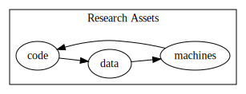
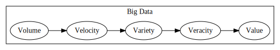
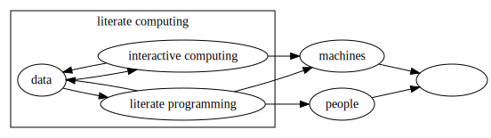

⓶ `technical.ipynb`

    digraph{rankdir="LR"; subgraph cluster{label="Research Assets"; code->data->machines->code}}

# The Modern Scientist

... uses computers as research equipment to generate data and reports.  They manage a lot information with varying degrees of expertise.  They focus on narrative over tooling.

# Jupyter's Technical Value

0. Jupyter is data 
0. Jupyter is literate computing
0. Jupyter is for documents

---
---
---
---
---
---
---
---
---
---
---
---
---
---
---
---
---
---
---
---

#  Jupyter is data 

    digraph{rankdir="LR"; subgraph clusterd{label="Big Data"; Volume->Velocity->Variety->Veracity->Value}}

### Everyone has more data than they know what to do with.

# Jupyter *en*code*s* process as data.

Code🆙Data🆙

## Jupyter notebooks are `json`.  

    with open('technical.ipynb') as file: 
        nb = __import__('json').load(file)

#### `nbformat` provides validates our data for past, present, and future formats

    from nbformat import v1, v2, v3, v4, ValidationError 
    with open('technical.ipynb') as file: 
        nb = __import__('nbformat').read(file, as_version=4)

It assures our code is formatted correctly.
    
    try: 
        v4.new_notebook(cells=dict())    
    except ValidationError as Exception: print(Exception)
---

    {} is not of type 'array'
    
    Failed validating 'type' in notebook['properties']['cells']:
    
    On instance['cells']:
    {}

## Turning this presentation into [tidy data](https://www.google.com/search?q=tidy+data&oq=tidy+data&aqs=chrome..69i57j0l5.1976j0j7&sourceid=chrome&ie=UTF-8)
    
    thisPresentation = (
        the.Path().Path.rglob('*.ipynb')
        .filter(the.str().contains('checkpoint').not_())
        .map(λ[the.identity(), the.Path.read_text().json.loads().get('cells').pandas.DataFrame()])
        .dict().pandas.concat()
    )('.')

<table border="1" class="dataframe">  <thead>    <tr style="text-align: right;">      <th></th>      <th></th>      <th>cell_type</th>      <th>execution_count</th>      <th>metadata</th>      <th>outputs</th>      <th>source</th>    </tr>  </thead>  <tbody>    <tr>      <th rowspan="30" valign="top">collaboration.ipynb</th>      <th>0</th>      <td>markdown</td>      <td>NaN</td>      <td>{}</td>      <td>NaN</td>      <td>[⓷ `collaboration.ipynb`]</td>    </tr>    <tr>      <th>1</th>      <td>code</td>      <td>1.0</td>      <td>{}</td>      <td>[{'data': {'text/html': ['&lt;style&gt;\n', '.jp-Ren...</td>      <td>[    \n,     o = __name__ == '__main__'\n,    ...</td>    </tr>    <tr>      <th>2</th>      <td>code</td>      <td>2.0</td>      <td>{}</td>      <td>[]</td>      <td>[\n,     try: \n,         from .particles impo...</td>    </tr>    <tr>      <th>3</th>      <td>code</td>      <td>3.0</td>      <td>{}</td>      <td>[{'data': {'text/markdown': ['---\n', '---\n',...</td>      <td>[{.{Ⅎill}}\n, \n, # The Modern Scientist\n, \n,...</td>    </tr>    <tr>      <th>4</th>      <td>code</td>      <td>4.0</td>      <td>{}</td>      <td>[{'data': {'text/markdown': ['# Jupyter for sh...</td>      <td>[# Jupyter for sharing and collaboration\n, \n...</td>    </tr>    <tr>      <th>5</th>      <td>code</td>      <td>5.0</td>      <td>{}</td>      <td>[{'data': {'text/markdown': ['---\n', '---\n',...</td>      <td>[{.{Ⅎill}}\n, \n, # {.{topics[8]}}\n,     \n,   ...</td>    </tr>    <tr>      <th>6</th>      <td>code</td>      <td>6.0</td>      <td>{}</td>      <td>[{'data': {'text/markdown': ['    digraph{rank...</td>      <td>[    digraph{rankdir="LR";subgraph clusters{la...</td>    </tr>    <tr>      <th>7</th>      <td>code</td>      <td>7.0</td>      <td>{}</td>      <td>[{'data': {'text/markdown': ['---\n', '---\n',...</td>      <td>[{.{Ⅎill}}\n, \n, \n, ## Jupyter for Publishing...</td>    </tr>    <tr>      <th>8</th>      <td>code</td>      <td>8.0</td>      <td>{}</td>      <td>[{'data': {'text/markdown': ['---\n', '---\n',...</td>      <td>[{.{Ⅎill}}\n,     \n, ## Jupyter for Teaching]</td>    </tr>    <tr>      <th>9</th>      <td>code</td>      <td>9.0</td>      <td>{}</td>      <td>[{'data': {'text/markdown': ['# At Georgia Tec...</td>      <td>[# At Georgia Tech\n, \n, * https://github.com...</td>    </tr>    <tr>      <th>10</th>      <td>code</td>      <td>10.0</td>      <td>{}</td>      <td>[{'data': {'text/markdown': ['    http://loren...</td>      <td>[    http://lorenabarba.com/tag/open-edx/]</td>    </tr>    <tr>      <th>11</th>      <td>code</td>      <td>11.0</td>      <td>{}</td>      <td>[{'data': {'text/markdown': ["# [nbgrader](tea...</td>      <td>[# [nbgrader](teaching.nbgrader['embed'])\n, \...</td>    </tr>    <tr>      <th>12</th>      <td>code</td>      <td>12.0</td>      <td>{}</td>      <td>[{'data': {'text/markdown': ['    http://data8...</td>      <td>[    {.{teaching.bids['class']}}\n,     \n, # [...</td>    </tr>    <tr>      <th>13</th>      <td>code</td>      <td>13.0</td>      <td>{}</td>      <td>[{'data': {'text/markdown': ['&lt;blockquote clas...</td>      <td>[&lt;blockquote class="twitter-tweet" data-lang="...</td>    </tr>    <tr>      <th>14</th>      <td>code</td>      <td>14.0</td>      <td>{}</td>      <td>[{'data': {'text/markdown': ['---\n', '---\n',...</td>      <td>[{.{Ⅎill}}\n, \n, ## Jupyter for profit\n, \n, ...</td>    </tr>    <tr>      <th>15</th>      <td>code</td>      <td>15.0</td>      <td>{}</td>      <td>[{'data': {'text/markdown': ['---\n', '---\n',...</td>      <td>[{.{Ⅎill}}\n, \n, \n, ## Jupyter for Books]</td>    </tr>    <tr>      <th>16</th>      <td>code</td>      <td>37.0</td>      <td>{}</td>      <td>[{'data': {'text/markdown': ['# [Sebastian Ras...</td>      <td>[# {.{people.rasbt}}]</td>    </tr>    <tr>      <th>17</th>      <td>code</td>      <td>17.0</td>      <td>{}</td>      <td>[{'data': {'text/markdown': ['# [Python Machin...</td>      <td>[# [Python Machine Learning (2nd edition)](htt...</td>    </tr>    <tr>      <th>18</th>      <td>code</td>      <td>18.0</td>      <td>{}</td>      <td>[{'data': {'text/markdown': ['# [Introduction ...</td>      <td>[# [Introduction to Artificial Neural Networks...</td>    </tr>    <tr>      <th>19</th>      <td>code</td>      <td>36.0</td>      <td>{}</td>      <td>[{'data': {'text/markdown': ['# [Jake VanderPl...</td>      <td>[# {.{people.jakevdp}}]</td>    </tr>    <tr>      <th>20</th>      <td>code</td>      <td>20.0</td>      <td>{}</td>      <td>[{'data': {'text/markdown': ['## [Python Data ...</td>      <td>[## [Python Data Science Handbook]({.{publishin...</td>    </tr>    <tr>      <th>21</th>      <td>code</td>      <td>21.0</td>      <td>{}</td>      <td>[{'data': {'text/markdown': ["# Immersive on d...</td>      <td>[# Immersive on demand notebooks with [O'Reill...</td>    </tr>    <tr>      <th>22</th>      <td>code</td>      <td>22.0</td>      <td>{}</td>      <td>[{'data': {'text/markdown': ['---\n', '---\n',...</td>      <td>[{.{Ⅎill}}\n, \n, # {.{topics[9]}}]</td>    </tr>    <tr>      <th>23</th>      <td>code</td>      <td>23.0</td>      <td>{}</td>      <td>[]</td>      <td>[    {.{ligo_tutorial}}\n,     \n,     \n, ##  ...</td>    </tr>    <tr>      <th>24</th>      <td>code</td>      <td>24.0</td>      <td>{}</td>      <td>[{'data': {'text/markdown': ['    https://mybi...</td>      <td>[    https://mybinder.org]</td>    </tr>    <tr>      <th>25</th>      <td>code</td>      <td>25.0</td>      <td>{}</td>      <td>[{'data': {'text/markdown': ['    http://jupyt...</td>      <td>[    http://jupyterhub.readthedocs.io/en/latest/]</td>    </tr>    <tr>      <th>26</th>      <td>code</td>      <td>26.0</td>      <td>{}</td>      <td>[{'data': {'text/markdown': ['    http://zero-...</td>      <td>[    http://zero-to-jupyterhub.readthedocs.io/]</td>    </tr>    <tr>      <th>27</th>      <td>code</td>      <td>27.0</td>      <td>{}</td>      <td>[{'data': {'text/markdown': ['[![](https://ima...</td>      <td>[[![](https://image.slidesharecdn.com/xheoqqbx...</td>    </tr>    <tr>      <th>28</th>      <td>code</td>      <td>28.0</td>      <td>{}</td>      <td>[{'data': {'text/markdown': ['    https://www....</td>      <td>[    https://www.chanzuckerberg.com/wp-content...</td>    </tr>    <tr>      <th>29</th>      <td>code</td>      <td>29.0</td>      <td>{}</td>      <td>[{'data': {'text/markdown': ['---\n', '---\n',...</td>      <td>[{.{Ⅎill}}\n, \n, # {.{topics[10]}}\n, \n,     d...</td>    </tr>    <tr>      <th>...</th>      <th>...</th>      <td>...</td>      <td>...</td>      <td>...</td>      <td>...</td>      <td>...</td>    </tr>    <tr>      <th rowspan="5" valign="top">technical.ipynb</th>      <th>25</th>      <td>code</td>      <td>NaN</td>      <td>{}</td>      <td>[]</td>      <td>[    https://blog.github.com/2015-05-07-github...</td>    </tr>    <tr>      <th>26</th>      <td>code</td>      <td>NaN</td>      <td>{}</td>      <td>[]</td>      <td>[    https://getnikola.com/blog/\n, \n, ### Bl...</td>    </tr>    <tr>      <th>27</th>      <td>code</td>      <td>NaN</td>      <td>{}</td>      <td>[]</td>      <td>[{.{Ⅎill}}\n, \n, # Jupyter's Technical Value\n...</td>    </tr>    <tr>      <th>28</th>      <td>code</td>      <td>NaN</td>      <td>{}</td>      <td>[]</td>      <td>[## 🤛[The History and Community.](history.ipyn...</td>    </tr>    <tr>      <th>29</th>      <td>code</td>      <td>NaN</td>      <td>{}</td>      <td>[]</td>      <td>[]</td>    </tr>    <tr>      <th rowspan="8" valign="top">utils/badges.ipynb</th>      <th>0</th>      <td>code</td>      <td>1.0</td>      <td>{}</td>      <td>[]</td>      <td>[    __file__ = globals().get('__file__', 'bad...</td>    </tr>    <tr>      <th>1</th>      <td>code</td>      <td>2.0</td>      <td>{}</td>      <td>[]</td>      <td>[    @dataclass\n,     class Github:\n,       ...</td>    </tr>    <tr>      <th>2</th>      <td>code</td>      <td>13.0</td>      <td>{}</td>      <td>[]</td>      <td>[    @dataclass\n,     class Person(Github):\n...</td>    </tr>    <tr>      <th>3</th>      <td>code</td>      <td>9.0</td>      <td>{}</td>      <td>[]</td>      <td>[    @dataclass\n,     class Project(Github):\...</td>    </tr>    <tr>      <th>4</th>      <td>code</td>      <td>10.0</td>      <td>{}</td>      <td>[{'data': {'text/markdown': ["# [jupyter/noteb...</td>      <td>[    __name__ == '__main__' and Project(github...</td>    </tr>    <tr>      <th>5</th>      <td>code</td>      <td>11.0</td>      <td>{}</td>      <td>[{'name': 'stdout', 'output_type': 'stream', '...</td>      <td>[    if __name__ == "__main__":\n,         __i...</td>    </tr>    <tr>      <th>6</th>      <td>code</td>      <td>NaN</td>      <td>{}</td>      <td>[]</td>      <td>[]</td>    </tr>    <tr>      <th>7</th>      <td>code</td>      <td>NaN</td>      <td>{}</td>      <td>[]</td>      <td>[]</td>    </tr>    <tr>      <th rowspan="8" valign="top">utils/search.ipynb</th>      <th>0</th>      <td>markdown</td>      <td>NaN</td>      <td>{}</td>      <td>NaN</td>      <td>[    https://github.com/conda-forge/feather-fo...</td>    </tr>    <tr>      <th>1</th>      <td>code</td>      <td>1.0</td>      <td>{}</td>      <td>[]</td>      <td>[    o = __name__ == '__main__'\n,     __file_...</td>    </tr>    <tr>      <th>2</th>      <td>code</td>      <td>2.0</td>      <td>{}</td>      <td>[{'data': {'text/markdown': ['    from feather...</td>      <td>[    from feather import write_dataframe, read...</td>    </tr>    <tr>      <th>3</th>      <td>code</td>      <td>3.0</td>      <td>{}</td>      <td>[{'data': {'text/markdown': ['    from inspect...</td>      <td>[    from inspect import signature]</td>    </tr>    <tr>      <th>4</th>      <td>code</td>      <td>4.0</td>      <td>{}</td>      <td>[{'data': {'text/markdown': ['The search tool ...</td>      <td>[The search tool will help in sorting through ...</td>    </tr>    <tr>      <th>5</th>      <td>code</td>      <td>5.0</td>      <td>{}</td>      <td>[{'data': {'text/markdown': ['    %rm ten.book...</td>      <td>[#     %rm ten.book.feather\n,     \n,     @da...</td>    </tr>    <tr>      <th>6</th>      <td>code</td>      <td>6.0</td>      <td>{}</td>      <td>[{'data': {'text/markdown': ['    book = Book(...</td>      <td>[    book = Book()\n, \n,     book["Materials ...</td>    </tr>    <tr>      <th>7</th>      <td>code</td>      <td>NaN</td>      <td>{}</td>      <td>[]</td>      <td>[    ]</td>    </tr>    <tr>      <th rowspan="7" valign="top">utils/style.ipynb</th>      <th>0</th>      <td>code</td>      <td>1.0</td>      <td>{}</td>      <td>[]</td>      <td>[    style = __import__('IPython').display.HTM...</td>    </tr>    <tr>      <th>1</th>      <td>code</td>      <td>2.0</td>      <td>{}</td>      <td>[]</td>      <td>[    style.data += """&lt;style&gt;\n,     .jp-mod-p...</td>    </tr>    <tr>      <th>2</th>      <td>code</td>      <td>18.0</td>      <td>{}</td>      <td>[]</td>      <td>[    style.data+="""&lt;style&gt;\n,     .jp-mod-pre...</td>    </tr>    <tr>      <th>3</th>      <td>code</td>      <td>19.0</td>      <td>{}</td>      <td>[]</td>      <td>[    style.data += """&lt;style&gt;\n,     .jp-mod-p...</td>    </tr>    <tr>      <th>4</th>      <td>code</td>      <td>28.0</td>      <td>{}</td>      <td>[]</td>      <td>[    style.data += """&lt;style&gt;\n,     .jp-mod-p...</td>    </tr>    <tr>      <th>5</th>      <td>code</td>      <td>29.0</td>      <td>{}</td>      <td>[{'data': {'text/html': ['&lt;style&gt;\n', '.jp-Ren...</td>      <td>[    style]</td>    </tr>    <tr>      <th>6</th>      <td>code</td>      <td>NaN</td>      <td>{}</td>      <td>[]</td>      <td>[]</td>    </tr>    <tr>      <th rowspan="2" valign="top">utils/unittest.ipynb</th>      <th>0</th>      <td>code</td>      <td>11.0</td>      <td>{}</td>      <td>[{'data': {'text/markdown': ["    if __name__ ...</td>      <td>[    if __name__ == '__main__':\n,         %re...</td>    </tr>    <tr>      <th>1</th>      <td>code</td>      <td>12.0</td>      <td>{}</td>      <td>[{'data': {'text/markdown': ['    def unittest...</td>      <td>[    def unittest(*tuple):\n,         """Unitt...</td>    </tr>  </tbody></table>
298 rows × 5 columns

---
---
---
---
---
---
---
---
---
---
---
---
---
---
---
---
---
---
---
---

#  Jupyter is literate computing

---

> ## The purpose of computing is insight, not numbers.
> - Richard Hamming

    graph {rankdir="LR"; data--science--computing--data}

#### ["Literate computing" and computational reproducibility: IPython in the age of data-driven journalism](http://blog.fperez.org/2013/04/literate-computing-and-computational.html)
> Our job with Jupyter~~IPython~~ is to think deeply about questions regarding the intersection of _**computing, data and science**_, but it's clear to me at this point that we can contribute in contexts beyond pure scientific research. I hope we'll be able to provide folks who have a _**direct intersection with the public**_, such as journalists, with tools that help a more informed and productive debate.

> - Fernando Perez

## Interactive Computing

#### [Fernando Perez](None) - [The IPython notebook: a historical retrospective 👍](http://blog.fperez.org/2012/01/ipython-notebook-historical.html)    

> I also read an article that mentioned two good interactive systems for Python, LazyPython and IPP, not surprisingly also created by scientists.  **I say this because the natural flow of scientific computing pretty much mandates a solid interactive environment**, so while other Python users and developers may like having occasional access to interactive facilities, **scientists more or less demand them**.  I contacted their authors,  Nathan Gray and Janko Hauser, seeking to join forces to create IPython;  they were both very gracious and let me use their code, but didn't have the time to participate in the effort.  *As any self-respecting graduate student with a dissertation deadline looming would do, I threw myself full-time into building the first 'real' IPython by merging my code with both of theirs* (eventually I did graduate, by the way).

    computing.licklider

    {'man-computer': 'https://en.wikipedia.org/wiki/Man-Computer_Symbiosis',
     'publications': 'https://en.wikipedia.org/wiki/J._C._R._Licklider#Publications',
     'topics': 'cybernetic, ai'}

* [Licklider](https://en.wikipedia.org/wiki/J._C._R._Licklider) - cybernetic, ai
* [Englebart](http://americanhistory.si.edu/comphist/englebar.htm) - [Mother of all Demos](https://www.youtube.com/watch?v=yJDv-zdhzMY)

    
* [Alan Kay](https://medium.com/the-polymath-project/alan-kay-on-how-many-books-you-can-read-in-a-lifetime-e0f08682b13d) - object-oriented computing, graphical UI, the personal computer
* [TBL](https://en.wikipedia.org/wiki/Tim_Berners-Lee) - The World Wide Web
* [Stephen Wolfram](https://en.wikipedia.org/wiki/Stephen_Wolfram)
* [Linus Torvalds](https://en.wikipedia.org/wiki/Linus_Torvalds) - [git](https://en.wikipedia.org/wiki/Git#History)
* [Willian Stein](https://wstein.org/) [SageMath](http://www.sagemath.org/) - [CoCalc](https://cocalc.com/)

### Interactive computing is multi-objective

Modern scientists must consider tools that improve their interactions with machines, not how fast the machine works.  

#### Tips for interactive computing

* <a href="https://en.wikipedia.org/wiki/Cache_(computing)">Caching</a>
    * Separating production data from archival research data
    
            from toolz import memoize
            from functools import lru_cache
        
* [Parallelization](https://en.wikipedia.org/wiki/Parallel_computing)

            from joblib import delayed, parallel
            import ipyparallel
    
* [Functional Programming](http://toolz.readthedocs.io/en/latest/heritage.html) _because names are the worst_

            from toolz import curry
* [Reading over writing](https://en.wikipedia.org/wiki/Literate_programming)

---
---
---
---
---
---
---
---
---
---
---
---
---
---
---
---
---
---
---
---

> ## ... surely nobody wants to admit writing an illiterate program.

## [Donald Knuth](https://en.wikipedia.org/wiki/Donald_Knuth) - [Literate Programming](http://roxygen.org/knuth-literate-programming.pdf)
    
* [$\TeX$](https://en.wikipedia.org/wiki/TeX)
* [The Art of Computer Programming](https://en.wikipedia.org/wiki/The_Art_of_Computer_Programming)
* [40 years of tests!](http://yakshav.es/the-patron-saint-of-yakshaves/)
* [Book of the Century](https://web.archive.org/web/20080820030403/http://www.americanscientist.org/bookshelf/pub/100-or-so-books-that-shaped-a-century-of-science)

#### Jupyter permits

    digraph {rankdir="LR"; subgraph clusterc{ label="literate computing"; data->"interactive computing" ->data -> "literate programming" ->data} {"interactive computing" "literate programming"} -> machines "literate programming" -> people {machines people} -> 🙉🙈🙊} 

* [Markdown](https://daringfireball.net/projects/markdown/) - Order, emphasis, and hierarchy in plain-text
* <a href="https://en.wikipedia.org/wiki/Statement_(computer_science)">Statements</a> & <a href="https://en.wikipedia.org/wiki/Expression_(computer_science)">Expressions</a> ~~[Von Neumann Architecture](https://en.wikipedia.org/wiki/Von_Neumann_programming_languages)~~
* [$\LaTeX$](https://en.wikipedia.org/wiki/laTeX)

## [Jupyter Rich Display System](http://jeffskinnerbox.me/notebooks/ipython's-rich-display-system.html)
    
    from IPython.display import (
        Audio, GeoJSON, HTML, 
        IFrame, Image, JSON, 
        Javascript, Latex, Markdown, 
        Math, SVG, VimeoVideo, 
        YouTubeVideo, display
    )

    1.0

---
---
---
---
---
---
---
---
---
---
---
---
---
---
---
---
---
---
---
---

## Jupyter Development Environments

Jupyter provides core abstractions for other modern literate computing interfaces.

### Browser
* [classic](https://github.com/jupyter/notebook)
* [lab](https://github.com/jupyterlab/jupyterlab)

### Desktop

Based on [Github Electron](<module 'ten.particles.github' from '/Users/tonyfast/_ten/ten/particles/github.ipynb'>)

* [NetFlix nteract](https://github.com/nteract/)
* [hydrogen](https://atom.io/packages/hydrogen)

### Cloud

* [jupyterhub](https://github.com/jupyterhub/jupyterhub)
* [Microsoft Azure](https://notebooks.azure.com/)
* [Google datalab](https://cloud.google.com/datalab/)
* [cocalc](https://cocalc.com/)

---
---
---
---
---
---
---
---
---
---
---
---
---
---
---
---
---
---
---
---

#  Jupyter is for documents

    import nbconvert
    print(nbconvert.__doc__)

    Utilities for converting notebooks to and from different formats.

# 👁❤️`nbconvert`

    if __name__ == '__main__':
        !jupyter nbconvert --to html $__file__
        !jupyter nbconvert --to markdown $__file__
        !jupyter nbconvert --to python $__file__
        # !jupyter nbconvert --to slides $__file__ 
        %rm technical.py

---

    [NbConvertApp] Converting notebook technical.ipynb to html
    [NbConvertApp] Writing 330906 bytes to technical.html
    [NbConvertApp] Converting notebook technical.ipynb to markdown
    [NbConvertApp] Support files will be in technical_files/
    [NbConvertApp] Making directory technical_files
    [NbConvertApp] Making directory technical_files
    [NbConvertApp] Writing 26587 bytes to technical.md
    [NbConvertApp] Converting notebook technical.ipynb to python
    [NbConvertApp] Writing 10024 bytes to technical.py

    http://nbviewer.jupyter.org/

        <iframe
            width="800"
            height="600"
            src="http://nbviewer.jupyter.org/"
            frameborder="0"
            allowfullscreen
        ></iframe>
        

    https://blog.github.com/2015-05-07-github-jupyter-notebooks-3/

        <iframe
            width="800"
            height="600"
            src="https://blog.github.com/2015-05-07-github-jupyter-notebooks-3/"
            frameborder="0"
            allowfullscreen
        ></iframe>
        

    https://getnikola.com/blog/

### Blogging with Jupyter

@damianavila

        <iframe
            width="800"
            height="600"
            src="https://getnikola.com/blog/"
            frameborder="0"
            allowfullscreen
        ></iframe>
        

---
---
---
---
---
---
---
---
---
---
---
---
---
---
---
---
---
---
---
---

# Jupyter's Technical Value

0. Jupyter is data 
0. Jupyter is literate computing
0. Jupyter is for documents

## 🤛[The History and Community.](history.ipynb)
## 🤜[Collaborative Literate Computing.](collaboration.ipynb)

